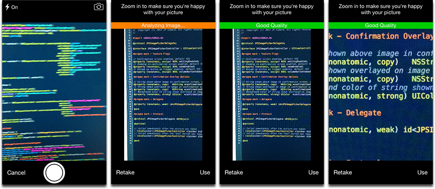

# JPSImagePickerController

A pixel-perfect clone of iOS 7's `UIImagePickerController`, with a few improvements. I built this because Apple's image picker is difficult to modify. Works on both iPad & iPhone.



Features:

* Front/Back camera switching
* Flash on/off
* Taking pictures in multiple orientations
* Triggering a picture with the "volume up" hardware button
* Confirmation screen
* Zooming the image in the confirmation screen
* Displaying a message in the confirmation screen

## Installation

### From CocoaPods

Add `pod 'JPSImagePickerController'` to your Podfile.

### Manually

Drag the `JPSImagePickerController` folder into your project and link the MediaPlayer and AVFoundation frameworks to your project.

## Usage

Just launch it modally and set its delegate:

```objective-c
JPSImagePickerController *imagePicker = [[JPSImagePickerController alloc] init];
imagePicker.delegate = self;
[self presentViewController:imagePicker animated:YES completion:nil];
```

Its delegate can respond to the following methods:

```objective-c
// Called immediately after the picture was taken
- (void)picker:(JPSImagePickerController *)picker didTakePicture:(UIImage *)picture;
// Called immediately after the "Use" button was tapped
- (void)picker:(JPSImagePickerController *)picker didConfirmPicture:(UIImage *)picture;
```

See sample Xcode project for more examples on how to configure.

## TODO

* Display a box around the tapped area when tapping to focus.
* Per-element rotation of "flash", "camera switch" and "Cancel" buttons. This is tricky because we don't want our whole layout to change, just those buttons.
* Better camera switching animation. It's currently a bit janky.
* Full reproduction of `UIImagePickerController`'s flash control. i.e. expanding to see "Auto", "On" & "Off"

## License

This project is under the MIT license.
